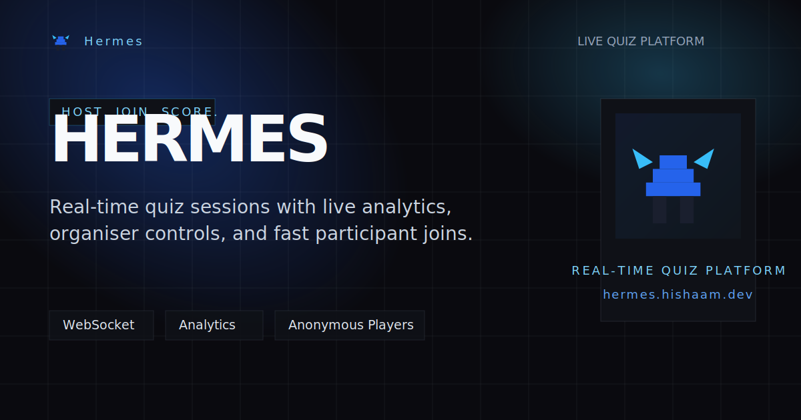

<!-- markdownlint-disable MD033 -->

<p align="center">
  
</p>

## Hermes

Hermes is a real-time quiz and live polling platform for organisers who need fast room setup, reliable session control, and instant participant feedback.

Create events, build quizzes, host live sessions, let players join with a code, and watch answers and results update in real time.

## What It Does

- Create and manage events, quizzes, and question banks
- Host live quiz sessions with question-by-question control
- Let participants join and rejoin sessions with a lightweight flow
- Stream lobby state, answers, and results over WebSockets
- Review quiz results for both organisers and participants after a session ends

## Tech Stack

[](https://nextjs.org/)
[](https://react.dev/)
[](https://www.typescriptlang.org/)
[](https://tailwindcss.com/)
[](https://bun.sh/)
[](https://www.framer.com/motion/)
[](https://spring.io/projects/spring-boot)
[](https://openjdk.org/)
[](https://spring.io/projects/spring-security)
[](https://www.postgresql.org/)
[](https://redis.io/)
[](https://www.rabbitmq.com/)
[](https://www.quartz-scheduler.org/)

## Quick Start (Docker)

```bash
docker-compose up --build
```

Then open:

- App: [http://localhost:3000](http://localhost:3000)
- API docs: [http://localhost:8080/swagger-ui.html](http://localhost:8080/swagger-ui.html)
- RabbitMQ dashboard: [http://localhost:15672](http://localhost:15672)

## Manual Dev Setup

### 1. Start infrastructure

```bash
docker-compose up -d postgres redis rabbitmq
```

### 2. Run backend

```bash
cd backend
./mvnw spring-boot:run
```

### 3. Run frontend

```bash
cd frontend
bun install
bun run dev
```

The frontend expects:

- `NEXT_PUBLIC_API_BASE_URL=http://localhost:8080`
- `NEXT_PUBLIC_WS_URL=ws://localhost:8080/ws-hermes`

## Backend Tests & Coverage

Backend tests use Testcontainers for PostgreSQL, Redis, and RabbitMQ, so Docker must be running.
The project targets Java 25; if your shell defaults to another JDK, pin `JAVA_HOME` for the command:

```bash
cd backend
JAVA_HOME=$(/usr/libexec/java_home -v 25) ./mvnw test
```

The test run also generates the JaCoCo report:

```bash
open target/site/jacoco/index.html
```

For a clean rebuild with tests and coverage:

```bash
cd backend
JAVA_HOME=$(/usr/libexec/java_home -v 25) ./mvnw clean test
```

## Project Docs

- Backend: [backend/README.md](./backend/README.md)
- Frontend: [frontend/README.md](./frontend/README.md)

## Contributor

- Md Hishaam Akhtar

<p align="center">
  Built for live rooms that need instant feedback.
</p>
